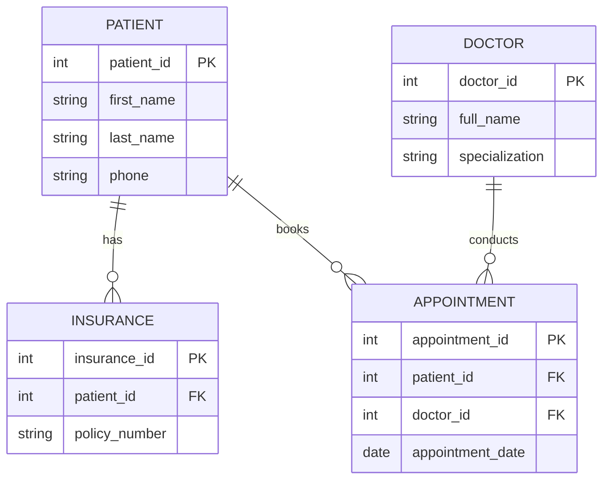

```mermaid
erDiagram

    PATIENT {
        int patient_id PK
        string first_name
        string last_name
        string phone
    }

    DOCTOR {
        int doctor_id PK
        string full_name
        string specialization
    }

    INSURANCE {
        int insurance_id PK
        int patient_id FK
        string policy_number
    }

    APPOINTMENT {
        int appointment_id PK
        int patient_id FK
        int doctor_id FK
        date appointment_date
    }

    PATIENT ||--o{ INSURANCE : has
    PATIENT ||--o{ APPOINTMENT : books
    DOCTOR  ||--o{ APPOINTMENT : conducts
```
